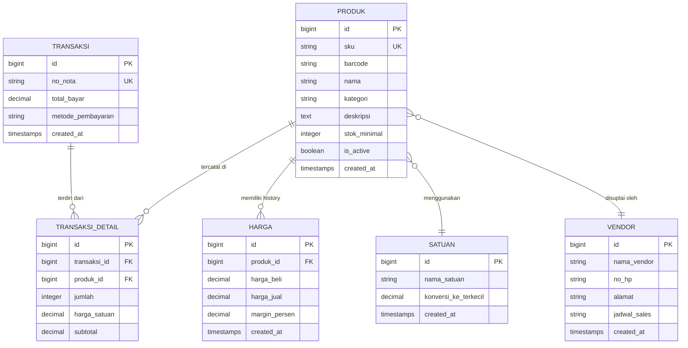

# Warung App Entity Relationship Diagram (ERD)

Berikut adalah gambaran hubungan antar tabel/model untuk aplikasi warung ini (Simplified):

## Penjelasan Singkat:
1.  **Item Master**: Induk dari segala barang (Data murni).
2.  **Produk**: Variasi spesifik dari Item Master (punya SKU & Barcode sendiri).
3.  **Harga**: Dicatat per produk agar bisa simpan history perubahan harga (lonjakan modal).
4.  **Satuan**: Untuk handle konversi (misal: jual per pcs tapi stok masuk per dus).
5.  **Vendor**: Menghubungkan produk dengan supplier-nya.
6.  **Transaksi & Detail**: Mencatat aktivitas kasir dan update stok otomatis via Observer.
