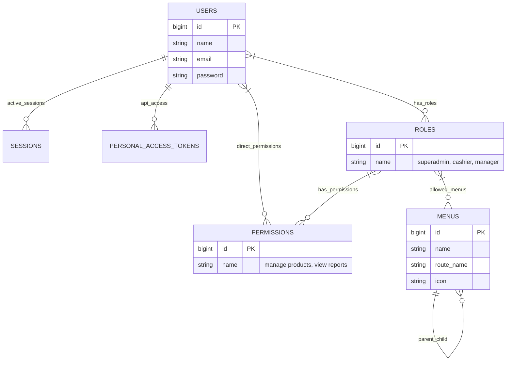

# Flow 01: Auth & Access Control (RBAC)

Diagram ini menjelaskan bagaimana sistem menangani login, session, dan hak akses (Permission) per Role.

```mermaid
erDiagram
    USERS ||--o{ SESSIONS : "active_sessions"
    USERS ||--o{ PERSONAL_ACCESS_TOKENS : "api_access"
    USERS }|--o{ ROLES : "has_roles"
    USERS }|--o{ PERMISSIONS : "direct_permissions"
    ROLES }|--o{ PERMISSIONS : "has_permissions"
    ROLES }|--o{ MENUS : "allowed_menus"
    MENUS ||--o{ MENUS : "parent_child"

    USERS {
        bigint id PK
        string name
        string email
        string password
    }
    ROLES {
        bigint id PK
        string name "superadmin, cashier, manager"
    }
    PERMISSIONS {
        bigint id PK
        string name "manage products, view reports"
    }
    MENUS {
        bigint id PK
        string name
        string route_name
        string icon
    }
```
