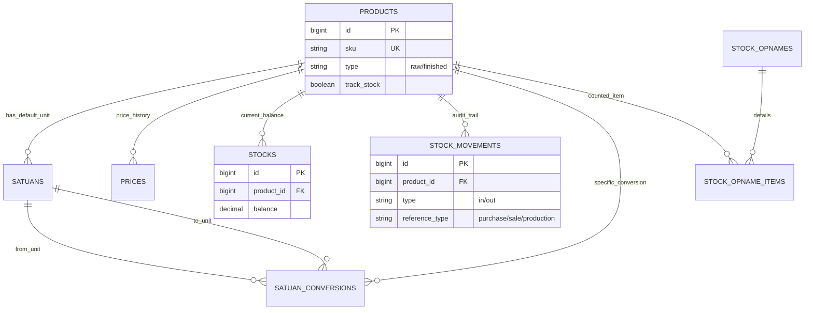

# Flow 02: Master Data & Inventory Core

Pondasi barang, satuan, dan bagaimana stok bergerak.

```mermaid
erDiagram
    PRODUCTS ||--o{ SATUANS : "has_default_unit"
    PRODUCTS ||--o{ PRICES : "price_history"
    PRODUCTS ||--o{ STOCKS : "current_balance"
    PRODUCTS ||--o{ STOCK_MOVEMENTS : "audit_trail"
    SATUANS ||--o{ SATUAN_CONVERSIONS : "from_unit"
    SATUANS ||--o{ SATUAN_CONVERSIONS : "to_unit"
    PRODUCTS ||--o{ SATUAN_CONVERSIONS : "specific_conversion"
    
    STOCK_OPNAMES ||--o{ STOCK_OPNAME_ITEMS : "details"
    PRODUCTS ||--o{ STOCK_OPNAME_ITEMS : "counted_item"

    PRODUCTS {
        bigint id PK
        string sku UK
        string type "raw/finished"
        boolean track_stock
    }
    STOCKS {
        bigint id PK
        bigint product_id FK
        decimal balance
    }
    STOCK_MOVEMENTS {
        bigint id PK
        bigint product_id FK
        string type "in/out"
        string reference_type "purchase/sale/production"
    }
```
