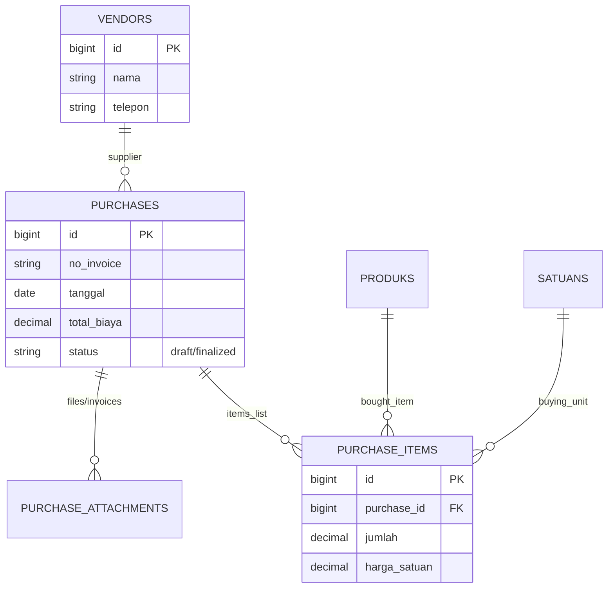

# Flow 03: Purchasing & Vendor (Inbound)

Proses pengadaan barang dari supplier luar.

```mermaid
erDiagram
    VENDORS ||--o{ PURCHASES : "supplier"
    PURCHASES ||--o{ PURCHASE_ITEMS : "items_list"
    PURCHASES ||--o{ PURCHASE_ATTACHMENTS : "files/invoices"
    PRODUKS ||--o{ PURCHASE_ITEMS : "bought_item"
    SATUANS ||--o{ PURCHASE_ITEMS : "buying_unit"

    PURCHASES {
        bigint id PK
        string no_invoice
        date tanggal
        decimal total_biaya
        string status "draft/finalized"
    }
    PURCHASE_ITEMS {
        bigint id PK
        bigint purchase_id FK
        decimal jumlah
        decimal harga_satuan
    }
    VENDORS {
        bigint id PK
        string nama
        string telepon
    }
```
