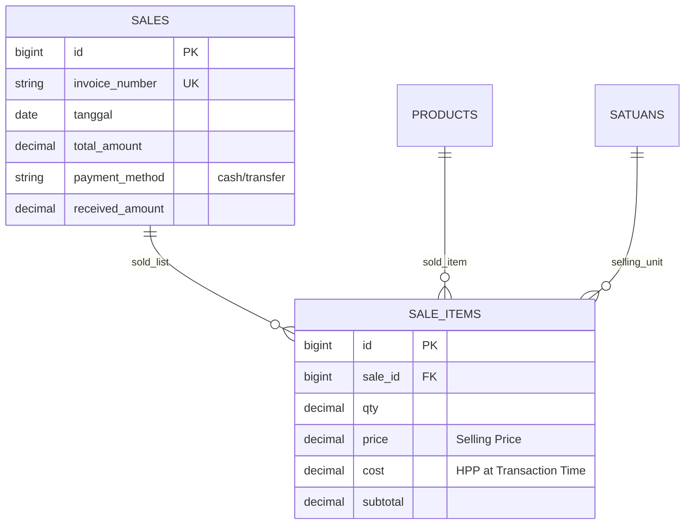

# Flow 04: Sales & POS (Outbound)

Proses penjualan barang ke pelanggan.

```mermaid
erDiagram
    SALES ||--o{ SALE_ITEMS : "sold_list"
    PRODUCTS ||--o{ SALE_ITEMS : "sold_item"
    SATUANS ||--o{ SALE_ITEMS : "selling_unit"

    SALES {
        bigint id PK
        string invoice_number UK
        date tanggal
        decimal total_amount
        string payment_method "cash/transfer"
        decimal received_amount
    }
    SALE_ITEMS {
        bigint id PK
        bigint sale_id FK
        decimal qty
        decimal price "Selling Price"
        decimal cost "HPP at Transaction Time"
        decimal subtotal
    }
```
