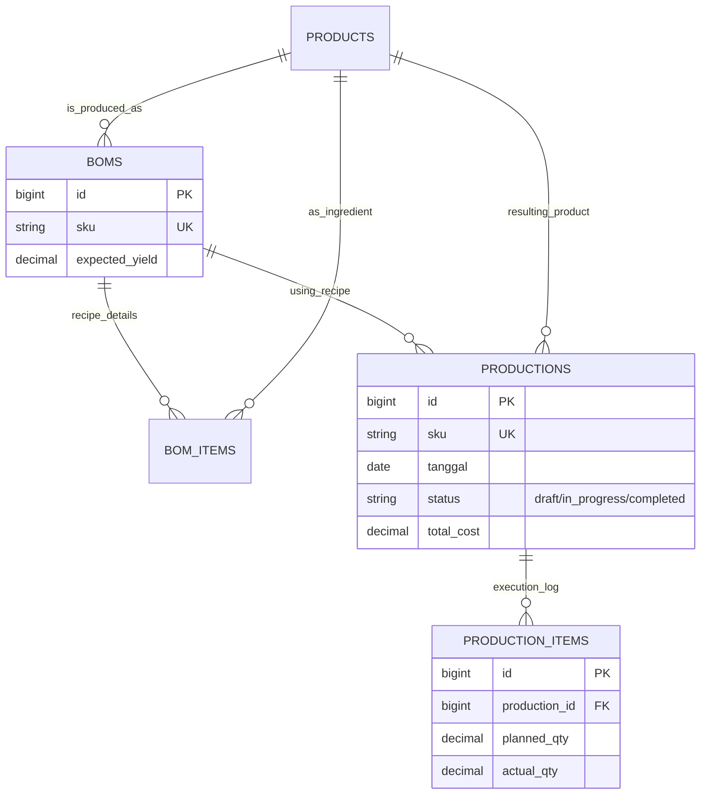

# Flow 05: Production & BOM (Manufacturing)

Proses pengolahan bahan baku menjadi barang jadi berdasarkan resep.

```mermaid
erDiagram
    PRODUCTS ||--o{ BOMS : "is_produced_as"
    BOMS ||--o{ BOM_ITEMS : "recipe_details"
    PRODUCTS ||--o{ BOM_ITEMS : "as_ingredient"
    
    PRODUCTIONS ||--o{ PRODUCTION_ITEMS : "execution_log"
    BOMS ||--o{ PRODUCTIONS : "using_recipe"
    PRODUCTS ||--o{ PRODUCTIONS : "resulting_product"

    BOMS {
        bigint id PK
        string sku UK
        decimal expected_yield
    }
    PRODUCTIONS {
        bigint id PK
        string sku UK
        date tanggal
        string status "draft/in_progress/completed"
        decimal total_cost
    }
    PRODUCTION_ITEMS {
        bigint id PK
        bigint production_id FK
        decimal planned_qty
        decimal actual_qty
    }
```
