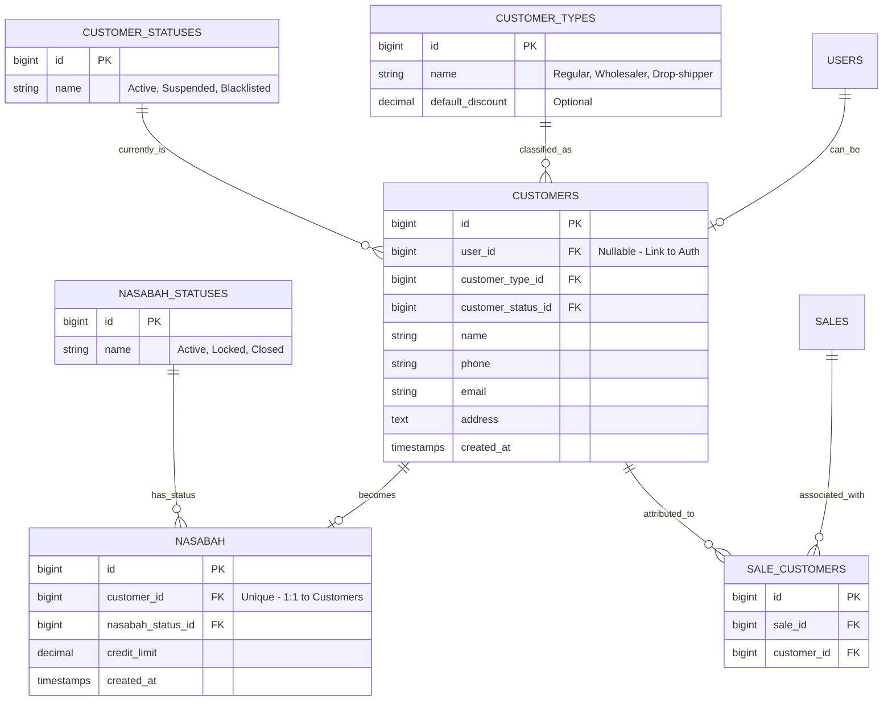

# Flow 06: Customer & Member Management

Modul ini menangani pengelolaan data pelanggan, klasifikasi tipe/status, integrasi login customer, serta scaffolding sistem nasabah (kredit).

## Relasi & Arsitektur
1. **Login System**: Tabel `CUSTOMERS` bersifat opsional terhadap `USERS`. Jika user_id diisi, maka orang tersebut bisa login sebagai role `customer`.
2. **Dynamic Meta**: `CUSTOMER_TYPES` dan `CUSTOMER_STATUSES` dipisah agar admin bisa menambah kategori baru tanpa mengubah struktur tabel/coding.
3. **Decoupled Sales**: Tabel `SALES` (Flow 04) tidak dimodifikasi. Sebagai gantinya, `SALE_CUSTOMERS` menjadi tabel penghubung (junction) untuk merekam siapa pembeli di suatu invoice.
4. **Nasabah Subset**: `NASABAH` adalah ekstensi dari `CUSTOMERS`. Seorang Nasabah wajib memiliki record induk di `CUSTOMERS`.
