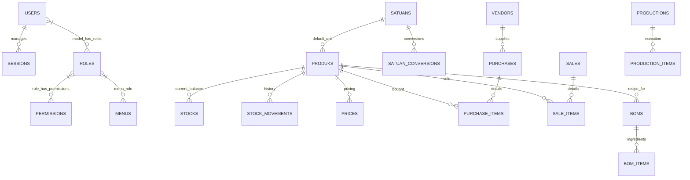

# Enterprise ERD - Warung / Sihati Baja System (Full Specification)
> Generated from PostgreSQL Schema Snapshot 2026-04-17

## 📑 Navigasi Modul
- [Diagram Visual Utama](#1-diagram-visual-utama)
- [Modul 01: Auth & Access (RBAC)](#modul-01-auth--access-rbac)
- [Modul 02: Master Data & Satuan](#modul-02-master-data--satuan)
- [Modul 03: Inventory & Stocks](#modul-03-inventory--stocks)
- [Modul 04: Procurement (Purchasing)](#modul-04-procurement-purchasing)
- [Modul 05: POS (Penjualan)](#modul-05-pos-penjualan)
- [Modul 06: Production (BOM)](#modul-06-production-bom)
- [Modul 07: Finance & Accounting](#modul-07-finance--accounting)

---

## 1. Diagram Visual Utama

---

## 🛠 Detail Tabel Lengkap

### Modul 01: Auth & Access (RBAC)
| Tabel | Kolom Utama |
|-------|-------------|
| **`users`** | `id`, `name`, `email`, `email_verified_at`, `password`, `remember_token`, `two_factor_secret`, `two_factor_confirmed_at`, `created_at`, `updated_at` |
| **`roles`** | `id`, `name`, `guard_name`, `created_at`, `updated_at` |
| **`permissions`** | `id`, `name`, `guard_name`, `created_at`, `updated_at` |
| **`menus`** | `id`, `parent_id`, `name`, `route_name`, `path`, `icon`, `permission_name`, `group_name`, `order_priority`, `is_active`, `created_at`, `updated_at` |

---

### Modul 02: Master Data & Satuan
| Tabel | Kolom Utama |
|-------|-------------|
| **`produks`** | `id`, `sku` (UK), `barcode`, `nama`, `kategori`, `deskripsi`, `stok_minimal`, `is_active`, `satuan_id` (FK), `type` (raw_material/finished_good), `track_stock`, `created_at`, `updated_at` |
| **`satuans`** | `id`, `nama` (UK), `simbol` (UK), `deskripsi`, `created_at`, `updated_at` |
| **`satuan_conversions`** | `id`, `satuan_id` (FK), `to_satuan_id` (FK), `rasio`, `produk_id` (FK-Optional), `created_at`, `updated_at` |
| **`prices`** | `id`, `produk_id` (FK), `satuan_id` (FK), `purchase_price`, `retail_price`, `wholesale_price`, `is_current`, `created_at`, `updated_at` |

---

### Modul 03: Inventory & Stocks
| Tabel | Kolom Utama |
|-------|-------------|
| **`stocks`** | `id`, `produk_id` (FK), `last_satuan_id` (FK), `balance`, `last_movement_id` (FK), `created_at`, `updated_at` |
| **`stock_movements`** | `id`, `produk_id` (FK), `satuan_id` (FK), `type` (in/out), `jumlah`, `reference_type`, `reference_id`, `keterangan`, `created_at`, `updated_at` |
| **`stock_opnames`** | `id`, `tanggal`, `keterangan`, `status` (draft/final/storno), `storno_at`, `storno_reason`, `created_at`, `updated_at` |
| **`stock_opname_items`** | `id`, `stock_opname_id` (FK), `produk_id` (FK), `satuan_id` (FK), `system_qty`, `physical_qty`, `created_at`, `updated_at` |

---

### Modul 04: Procurement (Purchasing)
| Tabel | Kolom Utama |
|-------|-------------|
| **`purchases`** | `id`, `no_invoice`, `vendor_id` (FK), `tanggal`, `transaction_type` (purchase/gift/adj), `status` (draft/finalized), `total_biaya`, `signature_log` (JSON), `created_at`, `updated_at` |
| **`purchase_items`** | `id`, `purchase_id` (FK), `produk_id` (FK), `satuan_id` (FK), `jumlah`, `harga_satuan`, `created_at`, `updated_at` |
| **`vendors`** | `id`, `nama`, `alamat`, `telepon`, `email`, `latitude`, `longitude`, `created_at`, `updated_at` |

---

### Modul 05: POS (Penjualan)
| Tabel | Kolom Utama |
|-------|-------------|
| **`sales`** | `id`, `invoice_number` (UK), `tanggal`, `total_amount`, `payment_method`, `received_amount`, `change_amount`, `notes`, `created_at`, `updated_at` |
| **`sale_items`** | `id`, `sale_id` (FK), `produk_id` (FK), `satuan_id` (FK), `qty`, `price`, `cost` (HPP), `subtotal`, `created_at`, `updated_at` |

---

### Modul 06: Production (BOM)
| Tabel | Kolom Utama |
|-------|-------------|
| **`boms`** | `id`, `produk_id` (FK), `nama`, `sku` (UK), `expected_yield`, `auto_deduct_on_sale`, `is_active`, `created_at`, `updated_at` |
| **`bom_items`** | `id`, `bom_id` (FK), `produk_id` (FK), `satuan_id` (FK), `jumlah`, `created_at`, `updated_at` |
| **`productions`** | `id`, `sku` (UK), `tanggal`, `bom_id` (FK), `produk_id` (FK), `target_yield`, `actual_yield`, `status` (draft/in_progress/completed/cancelled), `total_cost`, `created_at`, `updated_at` |
| **`production_items`** | `id`, `production_id` (FK), `produk_id` (FK), `satuan_id` (FK), `planned_qty`, `actual_qty`, `harga_satuan`, `created_at`, `updated_at` |

---

### Modul 07: Finance & Accounting
| Tabel | Kolom Utama |
|-------|-------------|
| **`journals`** | `id`, `tanggal`, `type` (debit/kredit), `amount`, `category`, `payment_method`, `reference_type`, `reference_id`, `balance`, `description`, `created_at`, `updated_at` |
| **`financial_summaries`** | `id`, `date` (UK), `total_debit`, `total_kredit`, `final_balance`, `created_at`, `updated_at` |
| **`pengeluarans`** | `id`, `tanggal`, `jenis_pengeluaran`, `nama_pengeluaran`, `nominal`, `keterangan`, `created_at`, `updated_at` |

---

## 📈 Alur Bisnis (Flow)
1.  **Inbound**: `Purchases` -> `Stock Movements (In)` -> `Stocks (Update)`.
2.  **Manufacturing**: `Productions` -> `Stock Movements (Out - Bahan Baku)` & `Stock Movements (In - Barang Jadi)`.
3.  **Outbound**: `Sales` -> `Stock Movements (Out)` -> `Stocks (Update)`.
4.  **Audit**: `Stock Opnames` -> `Stock Movements (Adjustment)`.
