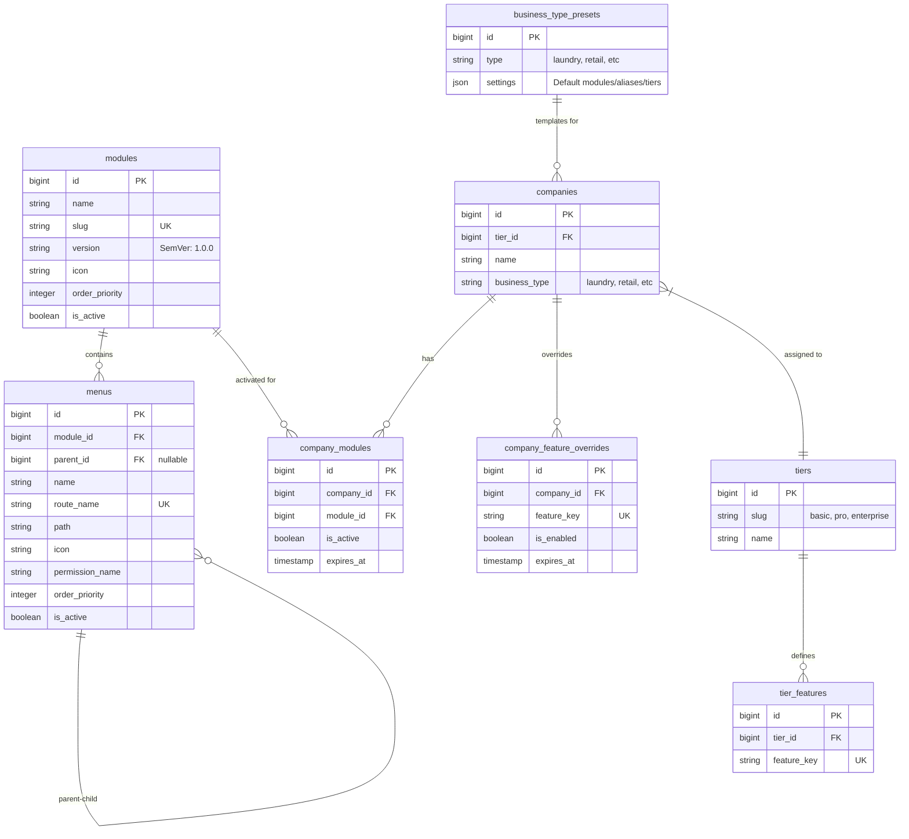

# Analisis & Rencana Manajemen Menu Dinamis (Add-on System)

## 1. Gambaran Arsitektur (Hardened Enterprise)
Sistem menggunakan pendekatan **Registry & Override-Driven** untuk fleksibilitas total dan keamanan data.

*   **Global Registry**: Tabel `modules` & `menus` dikelola via kode (Seeder).
*   **Tier Logic (Database-Driven)**: Tabel `tiers` & `tier_features` mengelola default fitur tiap paket (Basic, Pro, Enterprise).
*   **Granular Overrides**: Tabel `company_feature_overrides` mengelola pengecualian akses fitur per-perusahaan dengan masa aktif (`expires_at`).

## 2. Perubahan Major & Aturan Main
*   **Precedence Logic**: `Permission (Spatie) < Module Active < Tier Default < Company Override`.
*   **Database over JSON**: Tidak menggunakan kolom JSON untuk fitur agar data bisa di-index dan di-query secara efisien.
*   **Instant Expiry**: Pengecekan masa aktif fitur dilakukan secara real-time di level query.

## 3. Cons & Solusi Teknis (The Final Fixes)

| Kendala (Cons) | Solusi Strategis |
| :--- | :--- |
| **JSON Debt** | **Override Table**: Gunakan `company_feature_overrides`. Mendukung indexing, audit trail, dan migrasi data yang bersih. |
| **Static Tiering** | **DB Tier Mapping**: Simpan mapping fitur-ke-tier di database. Memungkinkan perubahan paket tanpa redeploy. |
| **Stale Access** | **Query-level Expiry**: Cek `expires_at` langsung di query `canAccess()`. Akses terputus seketika saat expired. |

## 4. Entity Relationship Diagram (ERD)



## 5. Logic Pattern (The Hardened Gate)

```php
public function canAccess(User $user, string $featureKey) {
    // 1. Check Override (Real-time Expiry)
    $override = CompanyFeatureOverride::where('company_id', $user->company_id)
        ->where('feature_key', $featureKey)
        ->where(function($q) {
            $q->whereNull('expires_at')->orWhere('expires_at', '>', now());
        })
        ->first();

    if ($override) return $override->is_enabled;

    // 2. Fallback to Tier Default
    return TierFeature::where('tier_id', $user->company->tier_id)
        ->where('feature_key', $featureKey)
        ->exists();
}
```

## 6. UI/UX Components & Patterns (Mapping Robust Modules)

### A. Komponen Global
*   **PageHeader**: `resources/js/components/PageHeader.vue`
*   **DataTable**: `resources/js/components/DataTable.vue`
*   **Badge SemVer**: `resources/js/components/ui/badge/Badge.vue`

### B. Pola Admin Module Manager (Superadmin)
*   **System Core Lock**: Referensi: `resources/js/pages/accounting/accounts/Index.vue` (Line 203-205).
*   **Toolbar Category Filters**: Referensi: `resources/js/pages/accounting/accounts/Index.vue` (Line 158-183).
*   **Dot Status**: Referensi: `resources/js/pages/accounting/accounts/Index.vue` (Line 230).

### C. Pola Add-on Manager (Tenant View)
*   **Grid of Cards**: Referensi: `resources/js/pages/pos/Index.vue`.
*   **Switch Toggle**: `resources/js/components/ui/switch/Switch.vue`
*   **Muted Grayscale**: Class Tailwind `grayscale opacity-50` untuk modul non-aktif.

### D. Menu Editor & Form
*   **Dialog / Slide-over**: `resources/js/components/ui/dialog/Dialog.vue`
*   **Visual Icon Picker**: Popover berisi grid icon `Lucide`.

## 7. Referensi Halaman (Benchmark)
*   **Halaman Katalog Produk**: `resources/js/pages/product/Index.vue`
*   **Halaman Chart of Accounts**: `resources/js/pages/accounting/accounts/Index.vue`

## 8. Lessons Learned & Migration Pitfalls (Template Task)

| Error Scenario | Cause | Prevention / Best Practice |
| :--- | :--- | :--- |
| **Duplicate Column** | Mencoba menambah kolom yang sudah ada di tabel tujuan (e.g. `business_type` di `companies`). | **Pre-check Schema**: Selalu jalankan `php artisan db:table [table]` atau cek file migrasi awal sebelum membuat migrasi modifikasi. |
| **404 Route on Seeded Menu** | Menu sudah di-seed ke database tapi Route belum didefinisikan di `web.php`. | **Route-Menu Sync**: Pastikan `route_name` di seeder memiliki pasangan yang valid di file Route sebelum melakukan testing UI. |
| **Constraint Violation** | Menghapus parent (Tier/Module) yang masih memiliki relasi aktif. | **Cascade Logic**: Selalu gunakan `cascadeOnDelete()` untuk relasi vital agar database tetap bersih. |
| **Audit Log Noise** | Seeder memicu ribuan log audit yang tidak perlu. | **Disable Auditing in Seeders**: Gunakan `Model::withoutEvents(fn() => ...)` saat melakukan heavy seeding. |
| **Invalid Layout Import** | Menggunakan nama layout yang salah (e.g. `AuthenticatedLayout` vs `AppLayout`). | **Check Layout Folder**: Selalu verifikasi nama file di `resources/js/layouts/` sebelum membuat halaman baru. |

---
*Dibuat berdasarkan diskusi analisis mendalam & audit arsitektur SaaS enterprise tingkat tinggi.*
